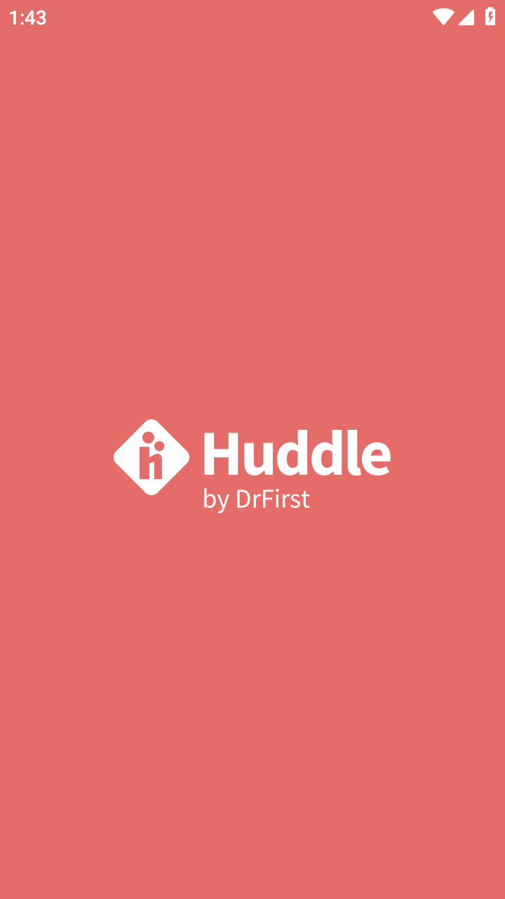
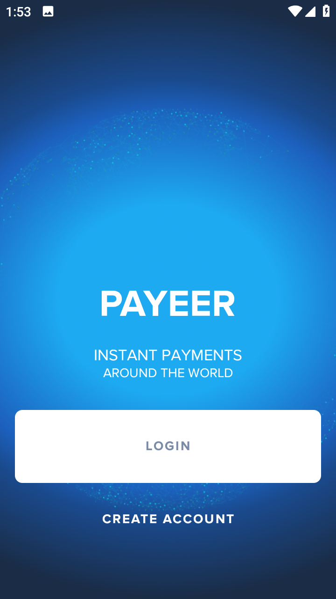
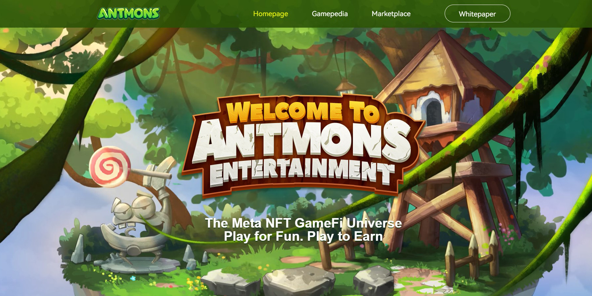

<h1 align="center"> ⭐ A Veteran Dev ⭐</h1>
<h3 align="center">Full Stack Engineer | Mobile Engineer | 10 Years Experience</h3>

<h3 align="left">🖋️ SUMMARY</h3>

  

   Accomplished and results-oriented Web & Mobile Developer with over ten years of extensive experience delivering high-impact digital solutions. Skilled across the full development spectrum, I bring expertise in both front-end and back-end technologies, consistently building scalable, resilient applications tailored for optimal user engagement. Known for meticulous attention to detail and a proactive approach to evolving tech landscapes, I am dedicated to designing and implementing solutions that not only meet but exceed business goals
  

  

<h3 align="left">🛠️ EXPERTISE</h3>
<ul>
  <li>Developing web front-end, back-end, and RESTful API</li>
  <li>Developing hybrid mobile applications with a clean and attractive designs.</li>
  <li>Programming solidity and rust for smart contracts that would be deployed to EVM chains and the Solana network.</li>
</ul>
<h3 align="left">✨ SPECIALIZATION</h3>
<ul>
  <li>SPA frameworks (React, Angular, Vue)</li>
  <li>React Native, Flutter, and Ionic development</li>
  <li>RESTful API and microservice development</li>
  <li>NFT marketplace, TokenSwap, wallets, trading bot development</li>
</ul>
<h3 align="left">📫 Languages and Tools</h3>

  

<h3><strong>🔖 PROJECT</strong></h3>
  <h4><strong>🌐 Web</strong></h4>
    <table align="center" style="border: 1px solid">
      <thead align="center">
        <tr align="center">
          <th align="center" style="border: 1px solid">APPICS</th>
          <th align="center" style="border: 1px solid">Bumble</th>
          <th align="center" style="border: 1px solid">Huddle Health</th>
          <th align="center" style="border: 1px solid">Payeer</th>
          <th align="center" style="border: 1px solid">Singlife</th>
        </tr>
      </thead>
      <tbody align="center">
        <tr>
          <td style="border: 1px solid">
            
          </td>
          <td style="border: 1px solid">
            
          </td>
          <td style="border: 1px solid">
            
          </td>
          <td style="border: 1px solid">
            
          </td>
          <td style="border: 1px solid">
            
          </td>
        </tr>
      </tbody>
    </table>
  <h4><strong>📱 Mobile Apps</strong></h4>
  <table align="center" style="border: 1px solid">
    <thead align="center">
      <tr align="center">
        <th align="center" style="border: 1px solid">APPICS</th>
        <th align="center" style="border: 1px solid">Bordeaux</th>
        <th align="center" style="border: 1px solid">Happy Fresh</th>
        <th align="center" style="border: 1px solid">Huddle Health</th>
        <th align="center" style="border: 1px solid">Payeer</th>
      </tr>
    </thead>
    <tbody align="center">
      <tr>
        <td style="border: 1px solid">
          
        </td>
        <td style="border: 1px solid">
          
        </td>
        <td style="border: 1px solid">
          
        </td>
        <td style="border: 1px solid">
          
        </td>
        <td style="border: 1px solid">
          
        </td>
      </tr>
    </tbody>
  </table>
  <h4><strong>🪙 Crypto, Web3</strong></h4>
    <table align="center" style="border: 1px solid">
      <thead align="center">
        <tr align="center">
          <th align="center" style="border: 1px solid">Antmons</th>
          <th align="center" style="border: 1px solid">BreadwinnersNFT</th>
          <th align="center" style="border: 1px solid">EZ.NFT</th>
          <th align="center" style="border: 1px solid">Riot Racers</th>
        </tr>
      </thead>
      <tbody align="center">
        <tr>
          <td style="border: 1px solid">
            
          </td>
          <td style="border: 1px solid">
            
          </td>
          <td style="border: 1px solid">
            
          </td>
          <td style="border: 1px solid">
            
          </td>
        </tr>
      </tbody>
    </table>
    <table align="center" style="border: 1px solid">
      <thead align="center">
        <tr align="center">
          <th align="center" style="border: 1px solid">Robotos Art</th>
          <th align="center" style="border: 1px solid">HighRollerNFT</th>
          <th align="center" style="border: 1px solid">Spherium.finance</th>
          <th align="center" style="border: 1px solid">Tired Troop</th>
        </tr>
      </thead>
      <tbody align="center">
        <tr>
          <td style="border: 1px solid">
            
          </td>
          <td style="border: 1px solid">
            
          </td>
          <td style="border: 1px solid">
            
          </td>
          <td style="border: 1px solid">
            
          </td>
        </tr>
      </tbody>
    </table>
